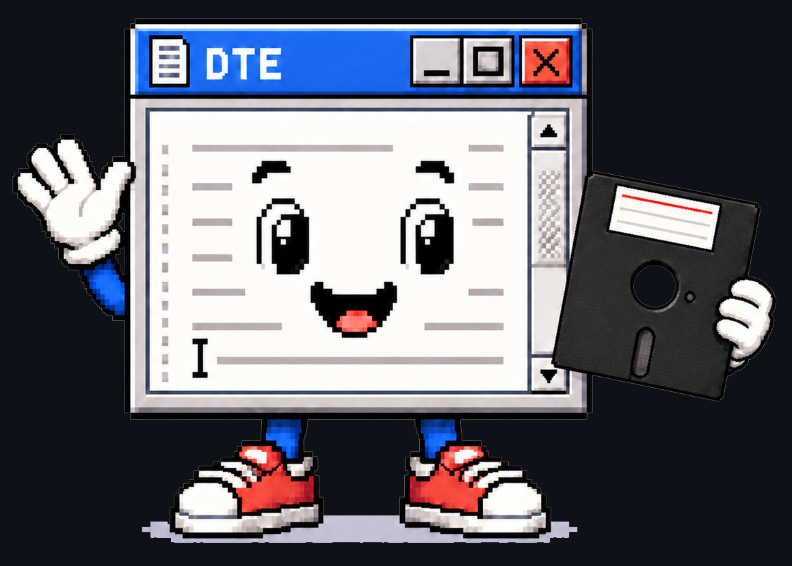
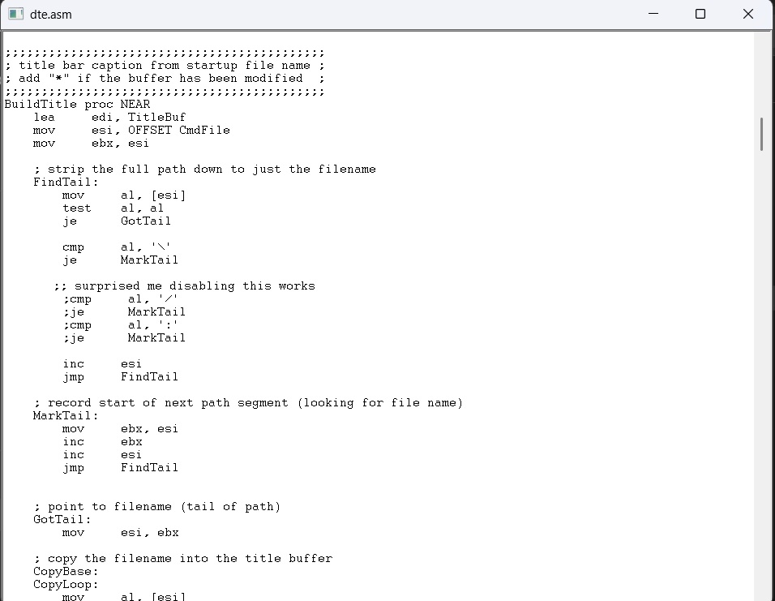

# Dave's Tiny Editor (DTE) v2.1.1
A working Windows text editor in 967 bytes. To use DTE, drag and drop a file onto dte.exe.<br><br>
Update: Some people correctly pointed out that DTE and TRPad were both grabbing 500mb of RAM at runtime. There were two errors causing this:<br>
1) The DTE code was literally asking for 500mb to be reserved via push 07FFFFFFEh. That is because I mistakenly set it that way thinking it allowed *up to* 500mb files. Those lines of code were removed.<br><br>
2) The builder build.bat needed to have /hashsize:# added for Crinkler. Here we're setting it to 11, giving a final exe of 967 bytes and DTE runs in 12mb of RAM. This is adjustable. For example, /hashsize:1 brings RAM usage down to 2mb and increases the exe size to about 985 bytes. Any /hashsize:# settings higher than 11 or so drastically increases RAM usage with little exe size reduction (about 1 byte).<br>

New! June 2026: DTE has in collaboration with Dave Plummer been expanded into TinyRetroPad, a full-featured Notepad work-alike editor in 2.62 kb! You can find TRPad [here](https://github.com/PlummersSoftwareLLC/TinyRetroPad) and a video about it [here](https://www.youtube.com/watch?v=OG91c7xsNMc).

<table border="0">
  <tr>
    <td>
      
    </td>
    <td rowspan="2">
      
    </td>
  </tr>
  <tr>
    <td>
      
    </td>
  </tr>
</table>

Compiles with: MASM and Crinkler.

DTE is an extension of `tiny.asm` HelloAssembly by Dave Plummer https://github.com/davepl. The idea is to make a working windowed text editor in the sub-1KB category. It uses Crinkler https://github.com/runestubbe/Crinkler compression at build time.

DTE is basically a wrapper around the RICHEDIT50W control from the WinAPI. Versions 1.0+ use the EDIT control with Crinkler cranked and were built-up from tiny.asm then worked down to 890 bytes with Win Defender quite unhappy. Versions 2.0+ have Crinkler backed-off a bit and use RICHEDIT to gain cheaper access to Courier font and much larger files. 2.0+ was then worked down from 995 to 967 bytes. 

**Important:** Programs using Crinkler can be flagged as a false positive by antivirus, including Windows Defender. You may need to make an antivirus exception folder to build this (especially for 1.0+), or Windows may delete the EXE as soon as the build completes. Therefore, try this out AT YOUR OWN RISK - NO WARRANTIES / NO GUARANTEES. You can accomplish this with PowerShell, but I am not going to tell you how. Sorry. You're on your own when messing with antivirus.

- MASM version used: Microsoft (R) Macro Assembler Version 14.44.35224.0 <br>

- MASM can vary depending on version. If you experience:
```
C:\masm32\include\winextra.inc(11052) : error A2026:constant expected
C:\masm32\include\winextra.inc(11053) : error A2026:constant expected
```
&nbsp;&nbsp;&nbsp;&nbsp;&nbsp;&nbsp;&nbsp;&nbsp;In masm32\include\winextra.inc change:<br>
```
    STD_ALERT struct<br>
        alrt_timestamp dd ?<br>
        alrt_eventname WCHAR  [EVLEN + 1] dup(?)
        alrt_servicename WCHAR [SNLEN + 1] dup(?)
    STD_ALERT ends
```
&nbsp;&nbsp;&nbsp;&nbsp;&nbsp;&nbsp;&nbsp;&nbsp;to:<br>
```
    STD_ALERT struct<br>
        alrt_timestamp dd ?<br>
        alrt_eventname WCHAR  (EVLEN + 1) dup(?)
        alrt_servicename WCHAR (SNLEN + 1) dup(?)
    STD_ALERT ends<br>
```
&nbsp;&nbsp;&nbsp;&nbsp;&nbsp;&nbsp;&nbsp;&nbsp;The brackets on lines 13,14 were changed to parens.<br>
- Build.bat contains: /LIBPATH:"C:\Program Files (x86)\\Windows Kits\\10\\Lib\\10.0.20348.0\\um\\x86"<br>
You may need to change to fit your system: /LIBPATH:"....\\Windows Kits\\10\\Lib\\(your version)\\um\\x86"
- You need to have Crinkler installed in a directory that has been added to PATH.<br>
Example: C:\utils\Crinkler.exe<br>

## Contents: <br>
| Folder | Description |
|--------|-------------|
| `1_0` | Version 1.0 non-mono font 926 bytes build.|
| `2_0_BACKUPS` | Version 2.0 more features, 967 bytes build from RICHEDIT to release.|

| File | Description |
|------|-------------|
| `build.bat` | Builds DTE from command line. |
| `DRAG ME ONTO DTE.txt` | How to use DTE. |
| `DTE ABOUT.txt` | Explains some design decisions. |
| `dte.asm` | The program. Version 2.1.1 |
| `LICENSE` | Usage permissions. |

## DTE in use: <br>



