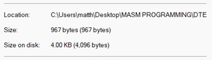
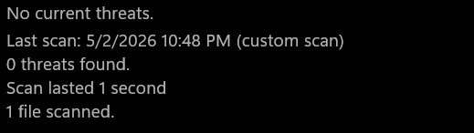
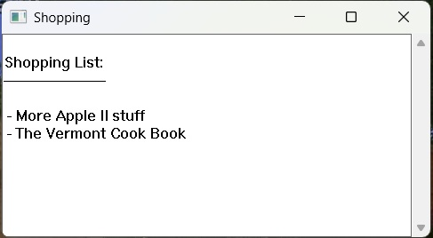

# Dave's Tiny Editor (DTE) v2.0.7
A working Windows text editor in 971 bytes.

Compiles with: MASM and Crinkler.

DTE is an extension of `tiny.asm` Hello Windows by Dave Plummer https://github.com/davepl. The idea is to make a working windowed text editor in the sub-1KB category. It uses Crinkler https://github.com/runestubbe/Crinkler compression at build time.

DTE is basically a wrapper around the RICHEDIT control from the WinAPI. Versions 1.0+ use the EDIT control with Crinkler cranked and were built-up from tiny.asm then worked down to 880 bytes with Win Defender quite unhappy. Versions 2.0+ have Crinkler backed-off a bit and use RICHEDIT to gain access to Courier font and much larger files. 2.0+ was then worked down from 995 to 971 bytes. 

**Important:** Programs using Crinkler can be flagged as a false positive by antivirus, including Windows Defender. You may need to make an antivirus exception folder to build this (especially for 1.0+), or Windows may delete the EXE as soon as the build completes. Therefore, try this out AT YOUR OWN RISK - NO WARRANTIES / NO GUARANTEES. You can accomplish this with PowerShell, but I am not going to tell you how. Sorry. You're on your own when messing with antivirus.

- MASM version used: Microsoft (R) Macro Assembler Version 14.44.35224.0  
- You need to have Crinkler installed in a directory that has been added to PATH. 
Example: C:\utils\Crinkler.exe 

## Contents:  
| Folder | Description |
|--------|-------------|
| `ALT BUILD` | A more aggressive 890 bytes build. Needs AV exception to be usable.|
| `BACKUPS` | The history of building up DTE from Hello Windows. |
| `ORIGINAL` | The original from davepl's GitHub. |

| File | Description |
|------|-------------|
| `build.bat` | Builds DTE from command line. |
| `DRAG ME ONTO DTE.txt` | How to use DTE. |
| `DTE ABOUT.txt` | Explains some design decisions. |
| `dte.asm` | The program. |
| `LICENSE` | Usage permissions. |

## DTE in action:  

