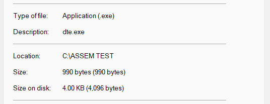
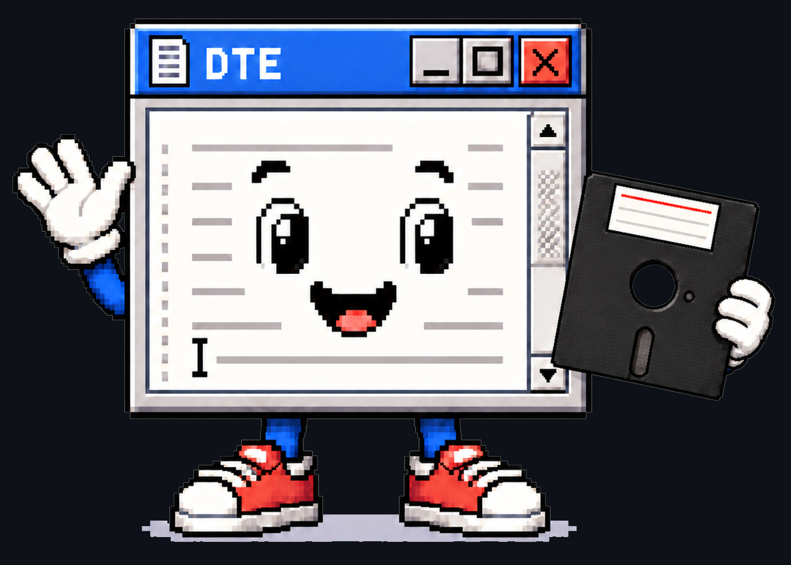
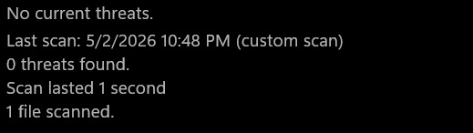
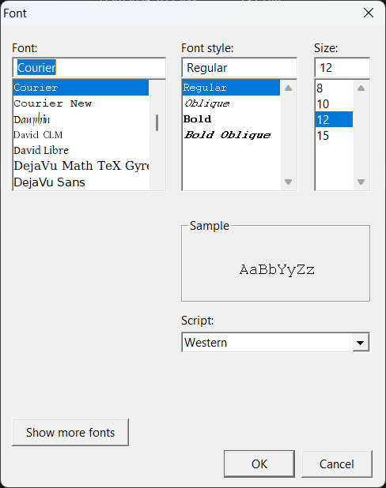
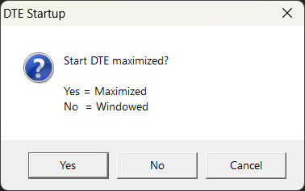
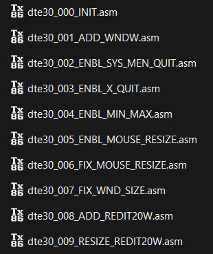
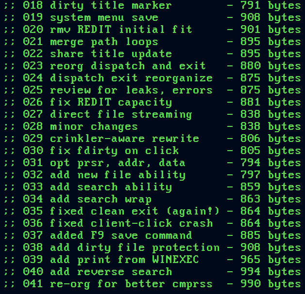
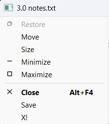
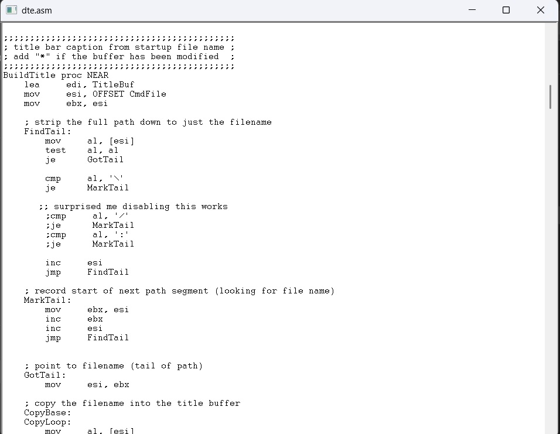
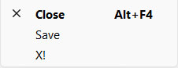

# Dave's Tiny Editor (DTE) v3.4.9
### A Windows Text Editor in 1024 Bytes. Font Selection, File Search, Replace, Print, Create New...<br>
<table border="0">
  <tr>
    <td>
      
    </td>
    <td rowspan="2" align="center">
      <br>
      "You can fit twelve hundred<br>
      of me on a 5¼″ floppy!"
    </td>
  </tr>
  <tr>
    <td>
      
    </td>
  </tr>
</table>

## I Font Believe It!

DTE has been expanded. `Version 3.4.9` now includes font selection and
startup state windowed/maximized. This is accomplished by
using a custom setup tool called `DTE_SETUP`.



`DTE_SETUP` modifies the DTE executable directly via open
tails added to DTE's framework.

DTE compiled now sits at 987 bytes, though without any
font setting. After building DTE, `DTE_SETUP` needs to be
run at least once to choose a font, font-size, and startup
mode.



`DTE_SETUP` writes the startup state at byte 996, the font
name at byte 1000, and the font size at byte 1020,
expanding the configured executable to 1024 bytes.

Several attempts were made to try and keep font selection
under 1000 bytes (just because) but all failed. DTE_SETUP
extends the configured executable to 1024 bytes so there is
room for the configuration tail.

There was still enough space "back in the nines" to allow
a custom start-up state to be either windowed or
maximized. Because of the effects of writing to the exe with
DTE_SETUP, the final size is 1024 whether we add the
startup mode or not. Might as well have it then.

## We're Not in Kansas Any More

The results are in: DTE is now a functioning notepad-like
editor in 1024 bytes with:

- font and startup mode selection via DTE_SETUP
- new file creation from the GUI (default file named `"f"`)
- `F12` sends the file to the active printer
- highlight any text and search with `F2` and `F3`
- search wraps after beginning/end of file
- replace text using search and clipboard
- save button in the system menu
- quick save with `F9`
- GUI `"X"` icon disabled on unsaved file
- `X!` (X Bang) "throw out changes"
- an unsaved file indicator `"*"`

Crinkler is now part of the project’s design. Instructions are
deliberately arranged so repeated structures fold together at
link time, making compression itself part of the coding process.

A printable [DTE User Manual](https://github.com/mpower-codeworks/Daves-Tiny-Editor/blob/main/manual.pdf)
in PDF is included with this distribution.

<table>
  <tr>
    <td colspan="2">
      <h4>
        If you are interested in more projects that make<br>
        basic utilities in very small packages, check out:
      </h4>
    </td>
  </tr>
  <tr>
    <td>
      <a href="https://github.com/mpower-codeworks/Sub-K-Very-Small-Web-Server">Sub-K</a>
    </td>
    <td>
      a very small web server
    </td>
  </tr>
  <tr>
    <td>
      <a href="https://github.com/mpower-codeworks/E">E</a>
    </td>
    <td>
      a very small telnet server
    </td>
  </tr>
</table>

## General Information

DTE 3.0 is a complete rewrite from a blank file up through to the
full-featured editor presented here with version `3.4.9`. Its
features include all of the above-listed plus: 

Fewer imports, persistent file handle, static class window, no
includes, file I/O via RICHEDIT20W, and by special appearance:

### A fake file dirty marker!


<br><br>

There is no flag to set, a `*` is simply appended to the title on file
change and removed on save.

## Source Code History

In the
[DTE](https://github.com/mpower-codeworks/Daves-Tiny-Editor/tree/main/DTE)
folder (I forgot to name it "src") enter the folder
[3_0](https://github.com/mpower-codeworks/Daves-Tiny-Editor/tree/main/DTE/3_0)
for the complete walk-up from a blank file to version `3.4.9`.

<table border="0">
  <tr>
    <td>
      
    </td>
    <td rowspan="2">
      
    </td>
  </tr>
</table>

## The New Features

The `New File` creation solution literally came to me in a dream. It just
appeared, and it worked. It's a bit unusual to start with a pre-named
blank file, but it works great and only cost 4 bytes. You will see that
in version `3.3.2`
[dte30_032.asm](https://github.com/mpower-codeworks/Daves-Tiny-Editor/blob/main/DTE/3_0/dte30_032_DEFAULT_S.asm).

With new-found confidence from a dream-state I started to think about
what other much-needed features could be added without the machinery of
dialog boxes and prompts. The file search by highlighted text was born,
and the rather unorthodox `X!` X Bang "throw away changes" ability was added.
It was now possible to bring back the "disable X if unsaved file"
previously rejected experiment from many versions ago. We now have cheap
file protection from accidental program closings. The
F9 Quick Save can be found in version `3.3.7`
[dte30_037_F9_SAVE.asm](https://github.com/mpower-codeworks/Daves-Tiny-Editor/blob/main/DTE/3_0/dte30_037_F9_SAVE.asm)
and the X Bang Quit override is in `3.3.8`
[dte30_038_X_BANG.asm](https://github.com/mpower-codeworks/Daves-Tiny-Editor/blob/main/DTE/3_0/dte30_038_X_BANG.asm).

`Find` was intentional; `Replace` was a discovery. To avoid dialog launching,
Find simply searches for the currently highlighted text. To search for
a word or phrase not currently in the document, just put it in the top
of the file and delete it later. When coding, you could make a little
search library in comments like:

```
/*
mainEntry
drawTable
*/
```

`Replace` was thought to be impossible without adding machinery until it
was realized that DTE already had a rudimentary Replace already. Just
copy the intended replacement text to clipboard, then highlight a search
term and press `F2` or `F3`. The found term will already automatically be
highlighted and `Ctrl-V` immediately replaces that text. In order to replace
next instance, press `Ctrl-Home` to go back to the top and highlight the
search term again. Press `F2`/`F3` again and repeat. It might seem clunky
at first glance, but in practice it works pretty decently. There is no
"Replace All", sorry.

`Printing` took forever to figure out. It needed to be extremely simple,
or discarded as an idea. I remembered that I had seen Microsoft Office
allow right-click on a file and choosing Print. After much thrashing about
and many failed attempts a solution was found: Let Notepad do it. Literally
just call `notepad /p "C:\whatever\file.txt"`. To ensure that Notepad doesn't
print an old version of the file, `F12` (print) is disabled unless the file
has been saved. You can't choose a printer from DTE. The default printer is
always used. You can find the Printing addition in version `3.3.9`
[dte30_039_F12_WINEXEC_PRINT.asm](https://github.com/mpower-codeworks/Daves-Tiny-Editor/blob/main/DTE/3_0/dte30_039_F12_WINEXEC_PRINT.asm).

I'll stick a
[PDF printed from DTE](https://github.com/mpower-codeworks/Daves-Tiny-Editor/blob/main/manual.pdf)
in the repo because hey, DTE can do that now.

## Crinkler is Not Bolted-On at the End

Well it was, originally. Allow me to explain.
[Version 1.0](https://github.com/mpower-codeworks/Daves-Tiny-Editor/tree/main/DTE/1_0)
of DTE is experimental. Crinkler in that version really was just tacked on. Nothing was
adjusted and
[Version 2.0](https://github.com/mpower-codeworks/Daves-Tiny-Editor/tree/main/DTE/2_0_BACKUPS)
with the RICHEDIT control was under development anyway. In version
2.0 Crinker was adjusted slightly to work better with A/V and some memory
refinements were configured. Mostly though, the result was the result.

[Version 3.0](https://github.com/mpower-codeworks/Daves-Tiny-Editor/tree/main/DTE/3_0)
was written with Crinker in mind every step of the way. Many groups
of instructions were rearranged several times testing how Crinker responded.
The massive drops in exe size from 908 bytes to 794 bytes were achieved this
way. Crinkler is not required for DTE 3.0 to build, but DTE 3.0 really is meant
to use it.

## More About DTE

(Old) New! June 2026: DTE `2.0` has in collaboration with
[Dave Plummer](https://github.com/davepl) been expanded into
TinyRetroPad, a full-featured Notepad work-alike editor in
2.62 kb! You can find TRPad
[here](https://github.com/PlummersSoftwareLLC/TinyRetroPad)
and a video about it [here](https://www.youtube.com/watch?v=OG91c7xsNMc).

 &#8592; You 
can find the Save and X Bang buttons in the window's system menu.

Compiles with: MASM and Crinkler.

Version `1.0` uses the `EDIT` control with Crinkler cranked and were built-up
from tiny.asm then worked down to 890 bytes with Win Defender quite unhappy. NOTE:
This has been stabilized at 926 bytes with no A/V issues.

Version `2.0` has Crinkler backed-off a bit and use RICHEDIT to gain cheaper
access to Courier font and much larger files. 2.0 was then worked down from
995 to 967 bytes.

Version `3.0` is a complete rewrite. A map is included showing the varying exe
sizes 

## Contents: <br>
| Folder | Description |
|--------|-------------|
| `1_0` | Version 1.0 non-mono font 926 bytes build with full history|
| `2_0_BACKUPS` | Version 2.0 more features, 967 bytes build from RICHEDIT to release|
| `3_0` | Version 3.0 complete rewrite, 1024 bytes build from blank to release|

| File | Description |
|------|-------------|
| `build.bat` | Builds DTE from command line |
| `manual.pdf` | How to use DTE |
| `DTE ABOUT.txt` | Explains some design decisions |
| `dte.asm` | The program. Version `3.4.9` |
| `LICENSE` | Usage permissions |

## DTE in use: <br>


## How to Use DTE:

A printable [DTE User Manual](https://github.com/mpower-codeworks/Daves-Tiny-Editor/blob/main/manual.pdf)
in PDF is included with this distribution.

### Opening an existing file:

Drag and drop it onto DTE.

### Creating a new file:

Double-click DTE to run it. A new file `"f"` will be automatically
created. If `f` already exists, then DTE simply opens that. Edit
the new file and Save. Quit DTE and rename `f` to whatever you
want.

### Saving a file:


<br><br><br><br>

Press `F9` or click the System Menu->Save.
There is no `"Save-As"`.

### Closing DTE

DTE now has unsaved-file protection. If the file is unsaved, 
the `GUI "X"` and the `System Menu->Close` (or `Alt-F4`) do
nothing. They are only enabled if a file is unchanged since
last save.


<br><br><br><br>

`X!` (X bang) in the system menu overrides the unsaved
protection and allows the user to `"throw away changes"`.

### Searching the file

Highlight any text in the file and press F3 to search forwards
or F2 to search backwards. DTE will highlight each next found
instance for every `F2` or `F3` keypress. End of file and beginning
of file both silently wrap to the other end. It can be very helpful
to place some common search terms at the top of the file
temporarily.

### One-time Replace (repeatable)

DTE has  no  Replace  dialog,  but  a  quick  one-time
replace is available. Copy the replacement text to the
Windows clipboard, highlight the text to find, and use
`F2` or `F3` to move to the desired instance. Press Ctrl+V
and the highlighted instance is immediately replaced.
To repeat, press `Ctrl-Home` to jump to the search term
at the top of the file and repeat.

### Printing a file

 `F12`
immediately prints to the active (default) printer. If the
active printer is PDF, a dialog will open to choose a file name
to save as. This is a trick. DTE is actually calling Notepad
with the `/p` flag. The user only briefly sees the `Notepad "Now printing"`
dialog. The Notepad editor never appears. Note: `F12` is disabled unless
the file has been saved.

### Compiling, and if You're New to Crinkler

**Important:** Programs using Crinkler can be flagged as a false positive by antivirus, including Windows Defender. You may need to make an antivirus exception folder to build this (especially for 1.0), or Windows may delete the EXE as soon as the build completes. Therefore, try this out AT YOUR OWN RISK - NO WARRANTIES / NO GUARANTEES. You can accomplish this with PowerShell, but I am not going to tell you how. Sorry. You're on your own when messing with antivirus.

- MASM version used: Microsoft (R) Macro Assembler Version 14.44.35224.0 <br>

- MASM can vary depending on version. If you experience:
```
C:\masm32\include\winextra.inc(11052) : error A2026:constant expected
C:\masm32\include\winextra.inc(11053) : error A2026:constant expected
```
&nbsp;&nbsp;&nbsp;&nbsp;&nbsp;&nbsp;&nbsp;&nbsp;In masm32\include\winextra.inc change:<br>
```
    STD_ALERT struct<br>
        alrt_timestamp dd ?<br>
        alrt_eventname WCHAR  [EVLEN + 1] dup(?)
        alrt_servicename WCHAR [SNLEN + 1] dup(?)
    STD_ALERT ends
```
&nbsp;&nbsp;&nbsp;&nbsp;&nbsp;&nbsp;&nbsp;&nbsp;to:<br>
```
    STD_ALERT struct<br>
        alrt_timestamp dd ?<br>
        alrt_eventname WCHAR  (EVLEN + 1) dup(?)
        alrt_servicename WCHAR (SNLEN + 1) dup(?)
    STD_ALERT ends<br>
```
&nbsp;&nbsp;&nbsp;&nbsp;&nbsp;&nbsp;&nbsp;&nbsp;The brackets on lines 13,14 were changed to parens.<br>
- Build.bat contains: /LIBPATH:"C:\Program Files (x86)\\Windows Kits\\10\\Lib\\10.0.20348.0\\um\\x86"<br>
You may need to change to fit your system: /LIBPATH:"....\\Windows Kits\\10\\Lib\\(your version)\\um\\x86"
- You need to have Crinkler installed in a directory that has been added to PATH.<br>
Example: C:\utils\Crinkler.exe<br>


